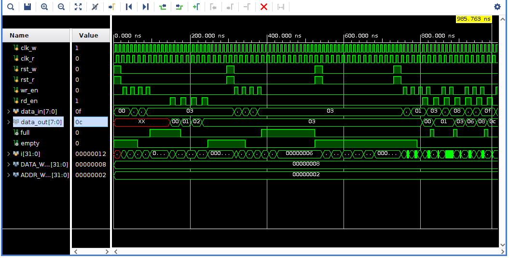

# 🔄 Asynchronous Dual Clock FIFO Design using Verilog

## 📌 Project Overview
This project implements an **Asynchronous FIFO (First-In First-Out) memory buffer** using Verilog HDL.  
It is designed to safely transfer data between **two different clock domains**:

- 🟦 Write Clock Domain (`clk_w`)
- 🟥 Read Clock Domain (`clk_r`)

The design ensures **data integrity across clock domains** using:
- Gray code pointers
- Dual flip-flop synchronizers
- Full and Empty flag logic

---

## ⚙️ Features

- 🔄 Dual clock domain FIFO (Asynchronous design)
- 🧠 Gray code pointer implementation
- 🔐 CDC (Clock Domain Crossing) safe design
- 📦 Parameterized depth and width
- ⚡ Full & Empty flag generation
- 🧪 Verified using comprehensive testbench

---

## 🧠 FIFO Architecture

### 📌 Key Components
- Memory array (FIFO storage)
- Write pointer (binary + Gray)
- Read pointer (binary + Gray)
- Synchronizers for CDC
- Full and Empty detection logic

---

## 🔐 Clock Domain Crossing (CDC)

To avoid metastability issues:

- Read pointer is synchronized into write clock domain
- Write pointer is synchronized into read clock domain
- Two-stage flip-flop synchronizers are used

---

## 📊 Full / Empty Logic

### 🚫 Empty Condition
FIFO is empty when:
- Read pointer == synchronized write pointer

### 🚫 Full Condition
FIFO is full when:
- Next write pointer equals read pointer with MSB inversion (Gray code technique)

---

## ⚙️ Parameters
      `
DATA_WIDTH = 8;   // Width of data bus
ADDR_WIDTH = 4;   // Depth = 2^ADDR_WIDTH

## 📂 Project Structure

```text
async_fifo_project/
│
├── async_fifo.v        # RTL Design (FIFO)
├── async_fifo_tb.v     # Testbench
├── README.md
├── simulation_log.txt  # TCL output
└── images/
    └── waveform.png
```


🧪 Testbench Description

The testbench verifies FIFO behavior under multiple scenarios:

✔ Test Cases Covered
🔹 Write operation test
🔹 Read operation test
🔹 Overflow condition test
🔹 Underflow condition test
🔹 Simultaneous read/write test

---

📊 Simulation Output
🔹 Waveform


---

🔹 Console Output

Simulation logs are captured using $display statements in both:

    Write clock domain
    Read clock domain

Stored in:

     simulation_log.txt

---

🔧 Design Highlights
✔ Safe clock domain crossing using Gray code
✔ Dual synchronizer flip-flops
✔ No race conditions between read/write clocks
✔ Fully parameterized FIFO design
✔ Industrial-style architecture

---

🚀 How to Run
Open project in Xilinx Vivado
Add:
async_fifo.v
async_fifo_tb.v

Run: Run Behavioral Simulation
Observe:
    Waveforms
    Console logs

---

🎯 Applications
      1 FPGA data buffering
      2 UART systems
      3 Video streaming buffers
      4 Multi-clock digital systems
      5 SoC communication blocks

---

📜 License

This project is licensed under the MIT License.

---

👨‍💻 Author

SHAIK ABDUL MATHEEN

---

Acknowledgement

This project was developed as part of learning Digital Design, FSM concepts, and Clock Domain Crossing (CDC) techniques.
